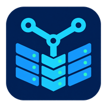

# YUB WPanel

<p></p>

YUB WPanel is a WordPress-focused server management panel for Debian 13 VPS environments. It helps you provision and operate WordPress sites with a single Go binary, embedded templates, and a workflow centered on security, isolation, backups, SSL, PHP-FPM, Nginx, MariaDB, and daily site operations.

YUB WPanel is licensed under GPL-3.0. Its source, installer, and signed releases are maintained at [zangwp/yub-wpanel](https://github.com/zangwp/yub-wpanel).

If you want the Chinese project README, see [README.md](README.md).

[](LICENSE)
[](https://go.dev/)

---

## Positioning

Generic Linux panels usually get bloated, complicated, and full of features that have nothing to do with WordPress.

YUB WPanel focuses on one job: **running WordPress sites efficiently on VPS servers**. It does not try to be a Docker platform, mail server, FTP server, or Java/Python/Node hosting stack.

## Feature Overview

| Module | What it does |
|------|------|
| **Site management** | Create WordPress sites in one step, then pause, enable, delete, or reinstall them; sites are isolated so a problem on one site is less likely to affect the others |
| **Site migration** | Move sites between two YUB WPanel servers running the same version, select several sites at once, follow their progress, and retry failed jobs |
| **WordPress updates** | Review and back up a site before updating WordPress, plugins, or themes; check the site afterward and restore it automatically if the update fails |
| **WordPress overview** | See WordPress versions, plugins, themes, and available updates for all sites on one page instead of checking every dashboard |
| **Maintenance protection** | Show a maintenance page while work is in progress and reopen the site afterward; temporary maintenance windows also end automatically |
| **SSL certificates** | Automatic Let's Encrypt issuance, automatic renewal before expiry, manual replacement, and self-signed certificates |
| **Site speed** | Cache pages and clear the cache from WordPress with one click; optionally optimize uploaded images to reduce storage and loading time |
| **Security defense** | Automatically slow or block common login attacks, malicious scans, and aggressive crawlers, while organizing suspicious activity for review |
| **Password recovery protection** | Choose per site whether password recovery is allowed, disabled for everyone, or disabled only for administrator accounts |
| **Database management** | Change database passwords, create automatic or manual backups, upload and restore backups, and open the database tool only when needed |
| **Scheduled tasks** | Manage scheduled work from the panel, replace unreliable WordPress Cron, and check whether backups and other jobs are running normally |
| **File manager** | Upload, download, copy, move, archive, extract, and search files much like a desktop file manager; large uploads can resume after interruption |
| **Dashboard** | Live CPU, memory, disk, and load monitoring with 24h/7d/15d historical charts |
| **System stability** | Add a memory safety buffer on small servers and preserve useful clues when memory runs out or an important service stops unexpectedly |
| **Site change monitoring** | Watch for unusual changes to administrators, content, important settings, application passwords, and site files |
| **AI diagnostics** | Gather site logs and service health in one step and continue with follow-up questions; diagnostics suggest next steps but do not change the site |
| **Alerts** | Receive email alerts for low resources, stopped services, expiring certificates or sites, and available updates; each alert type can be switched separately |
| **Software and runtime** | Manage PHP, Nginx, MariaDB, and Redis, inspect logs, and adjust PHP or Nginx settings for individual sites |
| **Panel security** | Use a private login path and two login checks; repeated password failures or repeated scans of invalid paths are restricted automatically |
| **Safe updates** | Check for panel and Debian software updates; panel packages are verified before installation and restored to the previous version if an update fails |
| **Backups and offsite copies** | Back up sites and panel data automatically, and copy site backups to another server or object storage to reduce single-server risk |

## One-Click Installation

```bash
apt-get update && apt-get install -y wget ca-certificates && wget -qO- https://raw.githubusercontent.com/zangwp/yub-wpanel/main/install.sh | bash
```

If GitHub is not reachable from your server, use the China-friendly installer:

```bash
apt-get update && apt-get install -y wget ca-certificates && wget -qO- https://cdn.jsdelivr.net/gh/zangwp/yub-wpanel@main/install-cn.sh | bash
```

After installation, the script prints the panel URL and the two login layers: BasicAuth and web login.

> The browser may warn about a self-signed certificate on the first visit. Click "Advanced" and continue.

## Quick Start

1. Install the panel with the one-line installer.
2. Open the panel URL printed by the installer.
3. Sign in with BasicAuth first, then complete the web login.
4. Run `yubw info` to confirm the panel version, port, and entry path.
5. Run `yubw status` to check whether the panel is healthy.
6. Use `yubw restart` if you need a quick restart.
7. Use `yubw password` if you need to reset the administrator password.
8. Use `yubw unban` if the administrator account or your IP was banned by mistake.

If you need a fresh WordPress site, use the site management pages in the panel UI to create one. The panel will handle the isolated user, web root, PHP-FPM pool, and MariaDB database for that site.

## Site Migration

YUB WPanel can move WordPress or generic PHP sites between two servers running the same YUB WPanel version. After upgrading both servers, open **Site Management → Site Migration**, connect the two panels, and select the sites you want to move.

- The migration can include site files, databases, domains and aliases, SSL certificates, and the main PHP, Nginx, monitoring, scheduled-task, and WordPress runtime settings.
- Backup history, access logs, security-event history, server-level remote-backup credentials, and custom-command scheduled tasks are not migrated.
- The source site enters HTTP 503 maintenance mode during migration to prevent new data from being written.
- The target server does not overwrite an existing site with the same domain. After migration, the administrator must verify the site and update DNS/CDN records manually.
- Migration is not an instant whole-server snapshot. Run it during a quieter period and check the storefront, dashboard, forms, orders, and other important flows before changing DNS.

## Security

**Short version: if the server and your computer have not already been compromised, the private login path and both sets of credentials remain secret, and YUB WPanel is kept up to date, an outsider relying only on internet scanning or guessing is extremely unlikely to enter the panel.**

A normal login requires the server's unique private path, the browser prompt, and the web login. Repeated attempts to find the path or guess passwords are restricted automatically. No internet-connected software can promise that compromise is impossible, but YUB WPanel does not rely on a single password for protection.

### Access Protection

- every server gets its own private path, making the login page harder for an unfamiliar scanner to find
- direct scanner traffic, or requests to 10 different invalid paths within one minute, are restricted automatically
- finding the path is not enough: the browser prompt and web login are two separate checks
- the login uses HTTPS, and error messages avoid exposing internal server details

### Anti-Bruteforce

- five failures at the browser prompt or web login in a short period restrict that source for 24 hours
- WordPress logins and SSH have their own protection; repeated attacks are restricted for progressively longer periods, up to seven days

### Site Isolation

- every site runs under its own system user and PHP-FPM pool
- every site uses its own MariaDB database
- one broken site should not take down the others

### WordPress-Specific Protection

- recognizes repeated login attempts, searches for common sensitive files, and bursts of requests to pages that do not exist
- rejects requests made with unknown domain names, reducing unnecessary exposure of site and certificate information
- groups suspicious activity by risk and shows the source, target, and suggested response; analysis alone does not automatically ban a visitor
- records newly created suspicious PHP files and unusually frequent access inside site directories
- can slow aggressive crawlers separately while minimizing the effect on ordinary visitors and routine dashboard work

### AI Operations Diagnostics

- collects logs and service health related to a site problem in one step, then supports follow-up questions
- provides analysis and troubleshooting suggestions only; it does not change files, databases, or server settings

### Backups and Offsite Copies

- site backups can be copied to another server or S3-compatible storage
- when a transfer fails, a local copy can be kept according to your settings

### Update Safety

- update packages are verified with YUB WPanel's independent Ed25519 public key so damaged or replaced files are rejected
- a failed update automatically restores the previous version so the panel can remain available

### Code Transparency

- 100% open source under GPL-3.0
- no sensitive business data is collected; anonymous stats are limited to the version number and can be disabled in the panel
- update checks connect only to GitHub, not to other external services
- no web shell and no online code editor
- passwords are stored with bcrypt cost 12, never in plain text

### Deep-Dive Security Notes

- **[Install script security transparency report](security/yub-wpanel-install-security.md)** - a section-by-section walkthrough of `install.sh`, including the common accusations about password tampering, Nginx removal, and WordPress compromise
- **[Runtime security: layered defense model](security/yub-wpanel-runtime-security.md)** - source-level explanation of the six-layer defense system, update signature checks, and software vulnerability management

## Security Testing

White-hat researchers are welcome to test this project. If you find a security issue, please report it in one of these ways:

- **Public report**: open a [GitHub Issue](https://github.com/zangwp/yub-wpanel/issues) and prefix the title with `[Security]`
- **Private report**: submit a Private Vulnerability Report through the GitHub Security tab
- Valid reports will be acknowledged in the Release Notes after the issue is fixed

## System Requirements

| Item | Requirement |
|------|------|
| Operating system | Debian 13 (Trixie) |
| CPU | 1 core or more |
| Memory | 1 GB or more (Swap is created automatically below that) |
| Architecture | x86_64 |

> Cloud vendor custom images can introduce unknown problems. If installation is troublesome, reinstall to a clean Debian 13 system with [bin456789/reinstall](https://github.com/bin456789/reinstall) and try again.

## Why These Tech Choices

**Why Debian 13?**

Debian is one of the most stable server distributions available. Trixie (Debian 13) was the latest stable release when development started. It gives us a recent kernel, newer package versions, and Debian's usual conservative stability policy. That means long-term security updates without forcing users to upgrade their base OS too often.

**Why lock to PHP 8.3?**

The WordPress project recommends PHP 8.3 or newer. PHP 8.3 is already widely tested in real production environments across the WordPress ecosystem, and it still has an active support window. Keeping the version fixed makes the runtime consistent, which helps reproduce and debug issues without fighting PHP version drift.

**Why MariaDB instead of MySQL?**

WordPress recommends MariaDB 10.6 or newer, and Debian 12/13 ships compatible MariaDB releases out of the box. Oracle MySQL comes with license and feature constraints. MariaDB is a fully compatible GPL fork driven by the community, and Debian's LTS packages provide security updates through 2028 without third-party repositories.

**Why build a Go binary instead of using Docker or PM2?**

The panel ships as a single binary with zero extra runtime dependency and is managed by `systemd`. It uses only a few dozen megabytes of memory, which is a good fit for 1 GB VPS plans. It does not share ports with Nginx, and there is no container layer or runtime overhead.

## Runtime Components

All runtime components are installed through APT packages; the panel does not compile them itself:

| Component | Notes |
|------|------|
| PHP 8.3 | Installed from Ondřej Surý's repository with isolated FPM pools |
| MariaDB | Debian-provided LTS release |
| Nginx | Debian stable package |
| Redis | Debian package |
| Fail2ban + nftables | Debian package |

## Technical Architecture

- **Backend**: Go + Gin web framework, SQLite in WAL mode, listening on port 8443 over HTTPS/TLS
- **Frontend**: HTML templates + TailwindCSS + Alpine.js + Chart.js
- **Distribution**: single binary with embedded frontend assets via `//go:embed`, around 20 MB
- **Security**: the panel is not tied to an Nginx reverse proxy and provides its own TLS termination

## SSH Management Commands

After installation, the panel provides a `yubw` command-line helper:

| Command | Description |
|------|------|
| `yubw` | Show panel information |
| `yubw restart` | Restart the panel |
| `yubw password` | Reset the administrator password in one step |
| `yubw info` | Show version, port, and entry path |
| `yubw status` | Show runtime status |
| `yubw unban` | Clear all IP bans for emergency recovery |

## Panel Database Backup and Restore

The panel stores its own data in SQLite and creates automatic backups every day at 2:30 AM, keeping the latest 7 copies in `/www/server/panel/backups/panel-db/`.

### When the Panel Is Working

From the "Panel Settings" page you can:

- create a backup manually
- download a backup file locally
- restore from a backup with an automatic safety backup before the restore
- delete backups

### Recovery When the Panel Cannot Start

If the panel cannot start after a database restore, or the database is damaged and the panel is no longer usable, recover it manually over SSH:

```bash
# 1. Check available backups
ls -lh /www/server/panel/backups/panel-db/

# 2. Stop the panel
systemctl stop yub-wpanel

# 3. Back up the damaged database first, just in case
cp /www/server/panel/panel.db /www/server/panel/panel.db.broken

# 4. Replace the current database with a backup file
cp /www/server/panel/backups/panel-db/panel_20260107_023000.db /www/server/panel/panel.db

# 5. Start the panel
systemctl start yub-wpanel

# 6. Check whether it is healthy
systemctl status yub-wpanel
journalctl -u yub-wpanel -n 20
```

### Importing a Backup After Reinstalling the Panel

If you need to reinstall the panel completely and then restore data:

```bash
# 1. Copy the backup set to a safe location
cp -r /www/server/panel/backups/panel-db/ /root/panel-db-backup/

# 2. Reinstall the panel (choose uninstall then reinstall, and keep site data)

# 3. Stop the panel after installation
systemctl stop yub-wpanel

# 4. Replace the new database with your backup
cp /root/panel-db-backup/panel_20260107_023000.db /www/server/panel/panel.db

# 5. Start the panel and let the database upgrade chain run
systemctl start yub-wpanel
```

> Older backups may miss newer database fields. When the panel starts, the upgrade chain will fill them in automatically.

## FAQ

### Does YUB WPanel need Docker?

No. YUB WPanel ships as a single Go binary and is managed by `systemd`.

### Does the panel use SQLite or MySQL?

The panel itself uses SQLite for panel state. WordPress sites use MariaDB databases.

### Does the panel listen behind a reverse proxy?

No. The panel serves HTTPS on its own and is not designed to depend on an Nginx reverse proxy.

### Can I restore a panel backup after reinstalling?

Yes. The README includes a manual restore flow for both a running panel and a reinstall recovery scenario.

### Can I sync site backups to remote storage?

Yes. Remote backup sync supports rsync/SSH and S3-compatible object storage.

### What if GitHub is blocked from my server?

Use the China-friendly `install-cn.sh` installer.

## Project Structure

```text
├── main.go               # program entry
├── config/               # global config management
├── database/             # SQLite connection and migrations
├── models/               # data structures
├── router/               # routes and page dispatch
├── middleware/           # BasicAuth / Session / CSRF / login throttling
├── handlers/             # HTTP handlers
├── executor/             # task executor
├── collector/            # system metrics collector
├── templates/            # HTML templates
├── static/               # JS assets
├── input.css             # TailwindCSS source
├── install.sh            # one-click installer
├── install-cn.sh         # China-friendly installer
├── security/             # security notes
└── yub-wpanel-optimizer/   # bundled WordPress plugin
```

## License

GPL-3.0
